<p align="center">
  
</p>

<p align="center">
  <a href="https://git.io/typing-svg">
    
  </a>
</p>

<p align="center">
  <a href="https://www.linkedin.com/in/simon-ramirezcs/" target="_blank" rel="noopener noreferrer">
    
  </a>
  <a href="mailto:simon.ramirez@stonybrook.edu">
    
  </a>
  <a href="https://github.com/its-Simy?tab=followers">
    
  </a>
  
</p>

<p align="center">
  
</p>

<h2 align="center">🏁 Driver Spec Sheet</h2>

```yaml
driver:      Simon Ramirez
team:        Stony Brook University · Computer Science
engine:      Backend Development
top_speed:   "0 → 60 in one commit"
off_season:  Snowboarding 🏂 (chasing fresh powder)
garage:      Cars, cars, and more cars 🏎️
motto:       "Simplicity reveals strength; the less you add, the more it speaks"
```

<h2 align="center">🔧 The Garage</h2>

<div align="center">

| ⚙️ Engine | 🎨 Bodywork | 🧰 Pit Tools |
|:---:|:---:|:---:|
|  |  |  |

</div>

<h2 align="center">📟 Telemetry</h2>

<p align="center">
  
  
</p>

<h2 align="center">🔥 Consecutive Laps</h2>

<p align="center">
  
</p>

<h2 align="center">⛰️ Elevation Profile</h2>
<p align="center"><sub>My contribution graph, which conveniently looks like a mountain range.</sub></p>

<p align="center">
  
</p>

<h2 align="center">🏆 Podium</h2>

<p align="center">
  
</p>

<h2 align="center">🏂 Fresh Tracks</h2>
<p align="center"><sub>Carving a line through the contribution grid. More commits = deeper powder.</sub></p>

<p align="center">
  <picture>
    <source media="(prefers-color-scheme: dark)" srcset="https://raw.githubusercontent.com/its-Simy/its-Simy/output/github-snake-dark.svg"/>
    <source media="(prefers-color-scheme: light)" srcset="https://raw.githubusercontent.com/its-Simy/its-Simy/output/github-snake.svg"/>
    
  </picture>
</p>

<p align="center">
  <i>"Simplicity reveals strength; the less you add, the more it speaks"</i><br/>
  <b>— Simon</b>
</p>

<p align="center">
  
</p>
